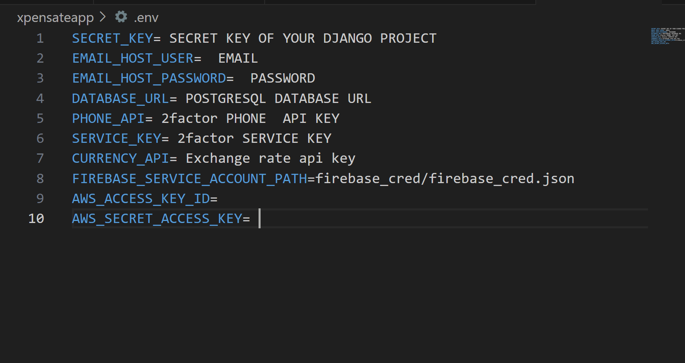

# Xpensate App

Xpensate is a user-friendly application designed to help individuals manage their expenses efficiently. With a clean interface and powerful features, users can track their spending, export the previous expenses , split bills, track their trips and gain insights into their financial habits.

## 📋 Prerequisites
- Python 3.x
- PostgreSQL
- Redis
- Virtual environment (recommended)

## How to use?

- Clone the repo 
    ```
    git clone https://github.com/Skyiesac/Xpensate-app.git
    cd Xpensate-app
    ```
- Install the dependencies
    ```
    pip install -r requirements.txt
    ```
- Create a .env file and set it up like this 
    

- Set up firebase_cred.json file inside a firebase_cred folder


- Now migrate and runserver
    ```
    python manage.py migrate
    python manage.py runserver
    ```
- Access the application at http://127.0.0.1:8000/

-To run the project in docker:
   ```
   docker-compose up --build
   ```


## Technical Stack

- **Backend**: Django REST Framework
- **Database**: PostgreSQL
- **Authentication**: JWT (JSON Web Tokens)
- **Storage**: AWS S3 for file storage
- **Notifications**: Firebase Cloud Messaging
- **Task Queue**: Celery[Redis] and Corntab for background tasks
- **API Documentation**: Postman
- **DevOps & Tools**
  - Docker containerization
  - Redis for background tasks
  - Nginx web server
  - AWS S3 for media storage


##Key features


### 1. Authentication & User Management
- Email and Phone OTP verification
- JWT Authentication
- Password reset functionality
- Profile management (username, currency, profile picture)
- Firebase notification integration for updates

### 2. Expense Tracking
- Track personal expenses with categories
- Upload receipts/bills
- Set monthly limits and budgets
- Categorize expenses (needs, luxury, savings)
- Credit/Debit transaction tracking
- Export expense data

### 3. Bill Splitting
- Create groups for bill splitting
- Add/remove group members
- Split bills equally or custom amounts
- Track settlements between members
- Mark payments as completed
- View group expense summaries

### 4. Trip Expense Management
- Create trip groups with invite codes
- Track trip-specific expenses
- Real-time settlement calculations
- Group member management
- Expense history and analytics

### 5. Analytics & Currency
- Currency conversion support
- Expense analytics and insights
- Budget tracking and alerts
- Monthly/yearly expense summaries
- Category-wise expense breakdown


## Frontend

The frontend for this application is developed by Sneha Bansal ([Sneha-005](https://github.com/Sneha-005)).


## Contributing

Contributions to Xpensate are welcome! If you encounter any issues or have suggestions/feedback for improvements, please feel free to open an issue or submit a pull request.

1. Fork the repository.
2. Create your feature branch (`git checkout -b feature/AmazingFeature`)
3. Commit your changes (`git commit -m 'Added some AmazingFeature'`)
4. Push to the branch (`git push origin feature/AmazingFeature`)
5. Open a Pull Request


---
⭐️ If you found this project helpful, please give it a star!!